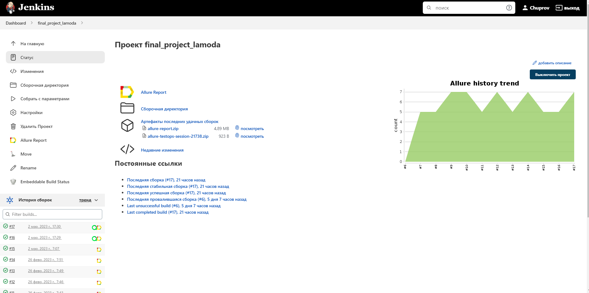
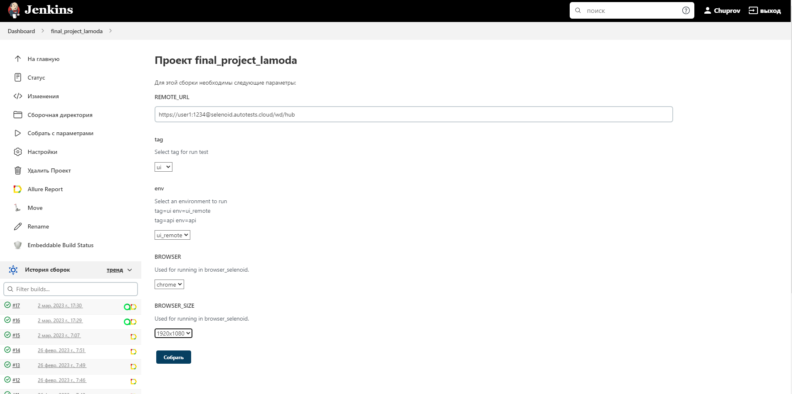
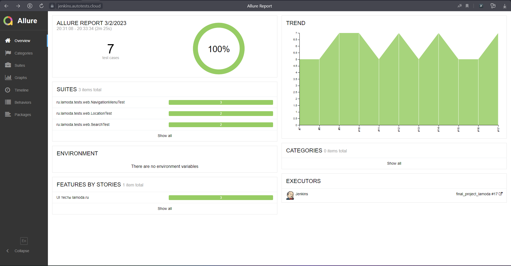
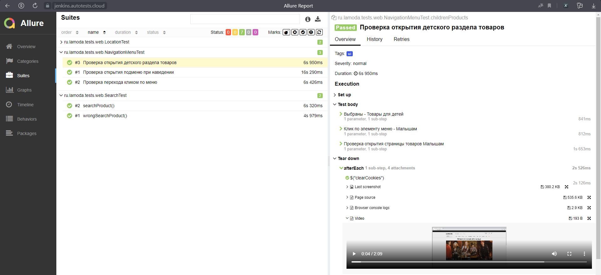
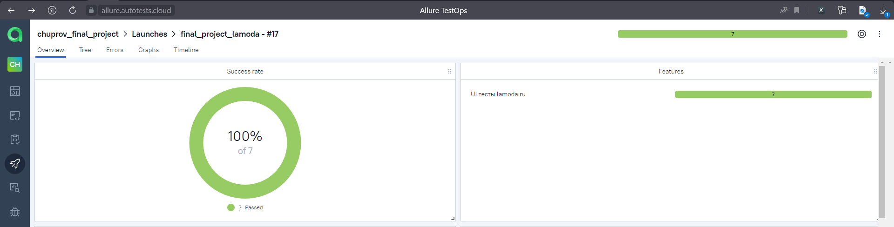
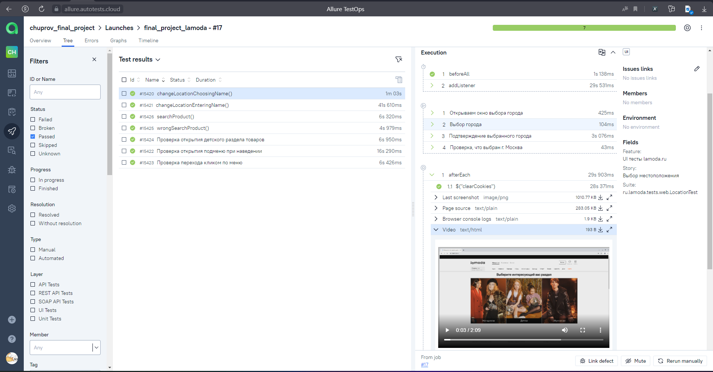
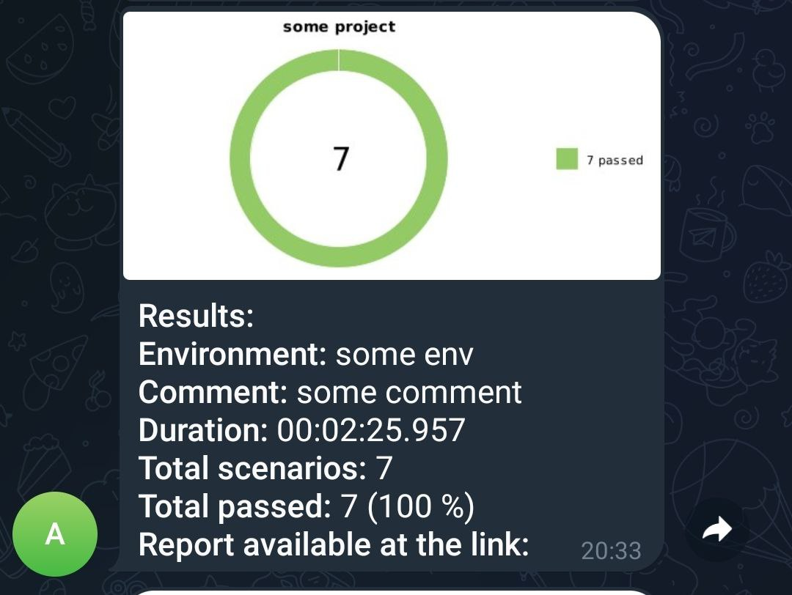
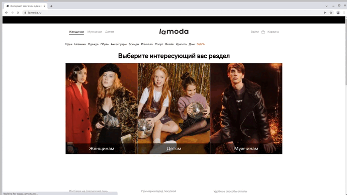

# Проект по автоматизации тестирования сайта [lamoda](https://lamoda.ru/)


# <a name="Technology">Технологический стек</a>
<p  align="center">
  <code></code>
  <code></code>
  <code></code>
  <code></code>
  <code></code>
  <code></code>
  <code></code>
  <code></code>
  <code></code>
  <code></code>
  <code></code>
</p>

Написан на `Java` с использованием фреймворка `Selenide`
Применяется фреймворк для модульного тестирования `JUnit 5`
`Gradle` используется для автоматизированной сборки проекта
Системы `Allure Report` и `Allure testops` формирут отчет о запуске тестов
`Telegram`-бот отправляет уведомление о результатах прохождения тестов


# <a name="HowToRun">Содержание тест-кейсов</a>

- [x] Добавление товара в корзину
- [x] Увеличение колличества выбранного товара
- [x] Удаление товара из корзины
- [x] Получение скидки 10%"
- [x] Сброс пароля
- [x] Проверка выбора города из списка
- [x] Проверка выбора города водом текста
- [x] Проверка перехода кликом по меню
- [x] Проверка открытия подменю при наведении
- [x] Выбор точного местоположения
- [x] Поиск существующего товара
- [x] Поиск не существующего товара

# <a name="HowToRun">Запуск тестов из терминала</a>

## <a name="GradleCommand">Локальный запуск тестов</a>

```bash
gradle clean test "-Dtag=api" "-Denv=api" 
```

## <a name="GradleCommand">Запуск с параметрами:</a>
```bash
clean
test
"-DselenoidUrl=${SELENOID_URL}"
"-Dtag=${ui}"
"-Denv=${ui_remote}"
"-Dbrowser=${BROWSER}"
"-DbrowserSize=${BROWSER_SIZE}"


```
###    Параметры сборки
```SELENOID_URL``` – адрес удаленного сервера, на котором будут запускаться тесты.

```Dtag``` – теги для запуска выполнения тестов.

```Denv``` – определяет среду для запуска этих тестов.

```SELENOID_URL``` – адрес удаленного сервера, на котором будут запускаться тесты.

```BROWSER_SIZE``` – размер окна браузера, в котором будут выполняться тесты.

```BROWSER``` – браузер, в котором будут выполняться тесты.


###  Запуск в **"Jenkins"**
Главная страница сборки:



Для запуска удаленных тестов необходимо заполнить параметры сборки:



###  Сформированный отчет **"Allure Report"**

Основной дашборд:

 

Список тестов с результатами прогона:

 

###  Интеграция с **"Allure TestOps"**

Основной дашборд:



Список тестов с результатами прогона:



###  Уведомления в Telegram с использованием бота

  

К каждому тесту в отчете прилагается видео.
<p align="center">
  
</p>


